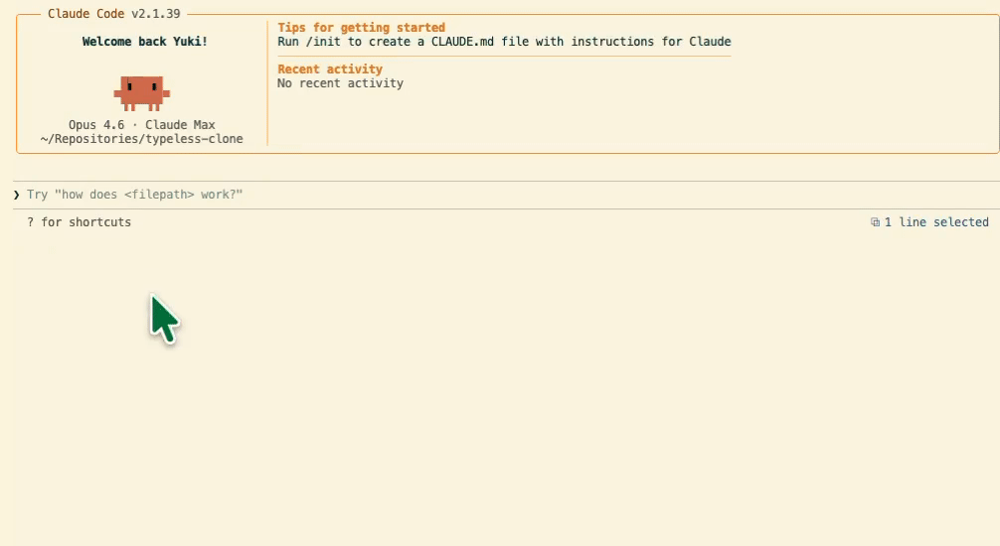

# koe!

**koe** = 声（こえ）。macOS メニューバー常駐の音声入力ユーティリティです。
`fn` を押している間だけ録音し、離したら文字起こししてアクティブアプリに貼り付けます。



## プライバシーとセキュリティ

- 開発者のサーバーにデータが送信されることはありません
- 音声認識は Apple のオンデバイス処理を使用しており、録音データが Mac の外に出ることはありません
- Gemini によるリライト機能を使う場合のみ、あなた自身が発行した API キーで Google に文字起こしテキストが送信されます
- API キーや設定はすべて Mac 内（UserDefaults）に保存されます
- サードパーティライブラリを含みません（Apple 純正フレームワークのみ）
- 利用状況の収集・送信は一切行いません

## インストール（DMG から）

開発環境は不要です。macOS 14 以上で動作します。

### 1. ダウンロード

[GitHub Releases](../../releases/latest) から最新の `Koe-*.dmg` をダウンロードしてください。

### 2. アプリを Applications にコピー

DMG を開いて `Koe.app` を `Applications` フォルダにドラッグ＆ドロップします。

### 3. 初回起動（Gatekeeper の許可）

このアプリはアドホック署名のため、初回起動時に macOS の Gatekeeper にブロックされます。

1. `/Applications/Koe.app` をダブルクリック → ブロックされるので **「完了」** を押す
2. **システム設定 > プライバシーとセキュリティ** を開く
3. 画面下部に表示される **「このまま開く」** をクリック
4. 確認ダイアログで **「開く」** をクリック（以降はダブルクリックで起動可能）

### 4. 権限を許可

初回起動時にダイアログが表示されるので、以下をすべて許可してください。

- マイク
- 音声認識
- アクセシビリティ（システム設定 > プライバシーとセキュリティ > アクセシビリティ）
- 入力監視（システム設定 > プライバシーとセキュリティ > 入力監視）

### 5. API キーを設定

メニューバーのアイコン →「設定」から **Gemini API キー** を入力してください。
[Google AI Studio](https://aistudio.google.com/apikey) で無料で取得できます。

> API キーを設定しなくても Apple の音声認識で文字起こしできますが、
> Gemini による校正（リライト）を使う場合はキーが必要です。

### 使い方

- `fn` を押しながら話す
- `fn` を離すと確定して貼り付け
- メニューバーのアイコンから手動録音も可能

## トラブルシュート

- `アクセシビリティを許可してください` が消えない
  - 許可対象が `/Applications/Koe.app` か確認
  - アプリ再起動を実施

- `fn` で起動しない
  - `入力監視` が ON か確認
  - システム設定 > キーボード > `🌐キーを押して` を `何もしない` に変更

- 設定をやり直したい
  - **ターミナル.app**（Launchpad > その他 > ターミナル）を開き、以下を 1 行ずつ貼り付けて実行してください

```bash
tccutil reset Accessibility com.koe.app
tccutil reset ListenEvent com.koe.app
tccutil reset PostEvent com.koe.app
```

> 実行後、アプリを再起動すると権限ダイアログが再表示されます。

---

## 開発者向け

### 前提環境

- macOS 14 以上
- Xcode Command Line Tools
- Swift 5.9+（`swift build` が動くこと）

### ソースからビルド

```bash
git clone https://github.com/hanafusay/koe.git
cd koe
cp .env.example .env
# .env に GEMINI_API_KEY=... を設定
./build.sh
open /Applications/Koe.app
```

`build.sh` は release ビルド → .app バンドル作成 → コード署名 → `/Applications` にインストールまで一括で行います。
DMG からインストール済みの場合でも、バンドル ID が同じため `/Applications/Koe.app` が開発ビルドで上書きされます。TCC 権限（アクセシビリティ・入力監視等）はそのまま引き継がれるので再設定は不要です。元に戻すには DMG から再インストールしてください。

権限付与後にアプリを再起動:

```bash
pkill -x Koe; open /Applications/Koe.app
```

### DMG の作成

```bash
./create-dmg.sh
# dist/Koe-<version>.dmg が生成される
```

### リリースの作り方

タグを push すると GitHub Actions が自動で DMG を作成し、GitHub Releases に公開します。

```bash
git tag v1.x.0
git push origin v1.x.0
```
